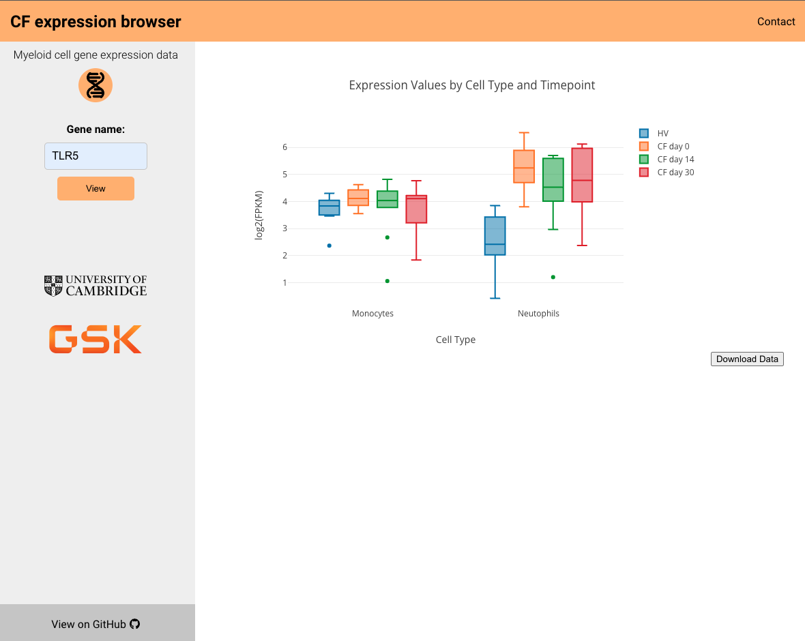

# cf-express

A web app for exploring myeloid cell gene expression data from Cystic Fibrosis patients.

🔗 [View the App](https://blueprint.haem.cam.ac.uk/cf-express/).

## About

The backend of the app was built using [Flask](https://flask.palletsprojects.com/) and interacts with a [PostgreSQL](https://www.postgresql.org/) database containing expression data. The frontend was constructed using [React](https://react.dev/), and in particular the [Create React App](https://create-react-app.dev/) tool.
